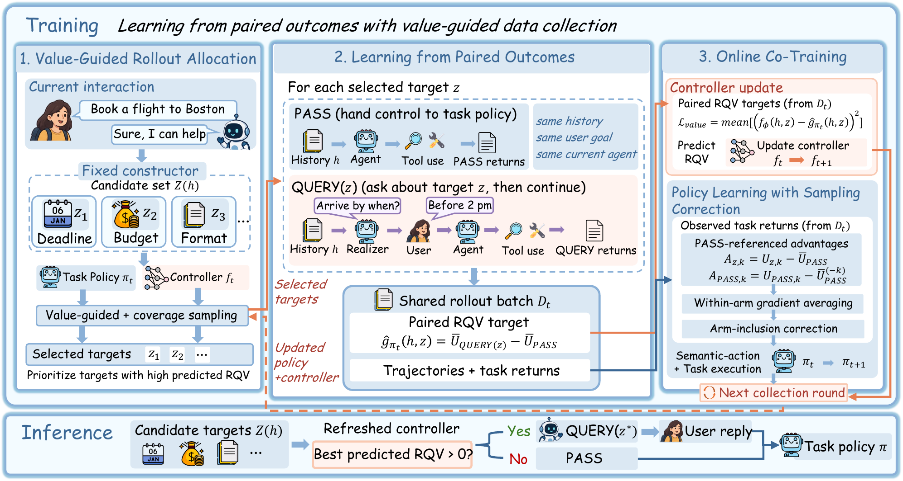
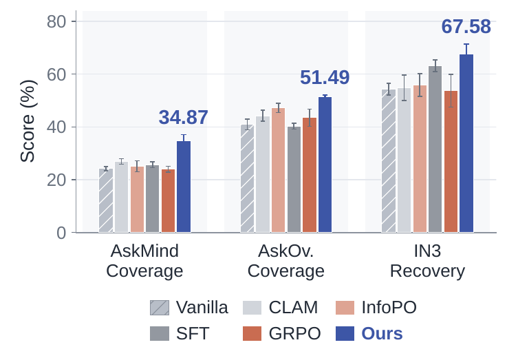
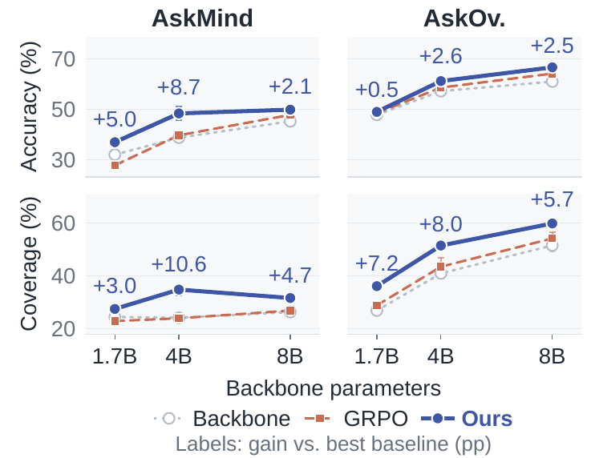

# CLEAT: Learning Value-Guided Clarification for Interactive Agents

LLM agents can execute increasingly complex tasks, but effective assistance also requires aligning their actions
with goals and constraints that users leave unstated. A clarifying question is useful only when the agent can turn
the answer into a better decision, and that changes as the agent learns.

**CLEAT** (CLarification through valuE-guided Agent co-Training) co-trains a clarification-value controller and the
task policy from shared interaction outcomes. The controller predicts the **residual query value**, the task utility
gained by asking a question rather than proceeding under the current policy, estimated from paired rollouts that
start from the same interaction history. The same paired returns train the policy to select useful questions and act
on the answers, and outcomes from the updated agent provide fresh value labels, so the clarification guidance adapts
as the agent improves.

<p align="center"></p>

## Overview

1. **Value-guided rollout allocation.** A fixed constructor proposes candidate clarification targets for the current
   history. Targets with high predicted residual query value are prioritised, with coverage sampling for exploration.
2. **Learning from paired outcomes.** For each selected target, a QUERY branch (ask, then continue) and a PASS branch
   (hand control to the task policy) are rolled out from the same history, with the same user goal and the same agent.
3. **Online co-training.** The controller is refit on the paired targets, and the policy is updated with
   PASS-referenced advantages and a correction for how each target was sampled.

At inference the controller asks about the target with the highest predicted value when that value is positive, and
otherwise hands control to the task policy.

## Results

With Qwen3-4B, CLEAT achieves the highest mean score in all ten evaluation settings across four benchmarks (mean over
3 seeds; Intention reports cumulative credits, all other columns are percentages).

| Method | Travel | Turtle | Inten. | Tele. | Airline | Retail | Telecom | IN3 Judg.Acc | AskMind | AskOv. |
|---|---|---|---|---|---|---|---|---|---|---|
| Vanilla | 26.74 | 17.97 | 185.50 | 49.12 | 23.78 | 20.89 | 20.00 | 65.74 | 38.70 | 57.24 |
| GRPO | 42.26 | 28.96 | 196.42 | 54.85 | 24.33 | 27.50 | 24.17 | 66.05 | 39.65 | 58.67 |
| Strongest baseline | 50.48 | 28.96 | 200.00 | 54.85 | 33.33 | 30.02 | 24.17 | 77.47 | 46.32 | 60.15 |
| **CLEAT** | **63.72** | **29.79** | **209.17** | **57.67** | **35.00** | **32.50** | **24.94** | **83.95** | **48.37** | **61.27** |

The strongest baseline is taken per column over prompting-based (ReAct, Reflexion, Proactive CoT, PRIME),
threshold-based (CLAM, INTENT-SIM, VoI-Gate), information-based (IG-Reward, InfoPO, IGPO) and outcome-based
(SFT, GRPO) methods. Travel, Turtle, Intention and Telepathy are UserGym; Airline, Retail and Telecom are tau2-bench.
The gains over the strongest baseline reach 13.24 points on Travel and 6.48 points on IN3 judgment accuracy.

<table>
<tr>
<td width="50%" align="center"></td>
<td width="50%" align="center"></td>
</tr>
<tr>
<td align="center">Complete clarification coverage on AskBench and instruction recovery on IN3.</td>
<td align="center">Answer accuracy and clarification coverage across backbone sizes, with gains over the stronger baseline.</td>
</tr>
</table>

## Requirements

```bash
pip install -r requirements.txt
```

The method uses two language models: the agent that is trained and a user simulator that also acts as judge.
Both are served through an OpenAI-compatible endpoint.

## Benchmarks

Get each benchmark from its page below and place it under `third_party/` (for example with `git clone <link> third_party/<name>`).

| Benchmark | `--dataset` | Download |
|---|---|---|
| AskMind | `ask_mind` | [link](https://github.com/jialeuuz/askbench) |
| AskOverconfidence | `ask_overconfidence` | [link](https://github.com/jialeuuz/askbench) |
| UserGym | `usergym` | [link](https://github.com/SalesforceAIResearch/UserRL) |
| IN3 | | [link](https://huggingface.co/datasets/hbx/IN3) |
| tau2-bench | | [link](https://github.com/sierra-research/tau2-bench) |

For datasets distributed as a task pool and a test file, `cleat/make_splits.py` builds the train, development
and test splits and removes pool tasks that also appear in the test set.

## Quick start

`run.sh` serves both models with vLLM, trains, and evaluates the final checkpoint on the test set with and
without the controller:

```bash
DATASET=<dataset> AGENT_MODEL=<agent model> USER_MODEL=<simulator model> bash run.sh
```

Extra arguments are passed to `cleat/train.py`; devices, ports and extra server flags can be set through the
variables at the top of `run.sh`. The defaults are the settings reported in the paper;
`python cleat/train.py --help` lists every option. To use endpoints that are already running, call
`cleat/train.py` and `cleat/evaluate.py` directly with `--agent-url` and `--user-url`.

## Outputs

| Path | Content |
|---|---|
| `runs/<dataset>/train.jsonl` | one row per training step: returns, residual query value, losses and interaction counts |
| `runs/<dataset>/eval.jsonl` | development-set episodes during training, with and without the controller |
| `runs/<dataset>/checkpoints/` | `warmup`, periodic `step-XXXX` and the deployed `final-refit` checkpoint |
| `runs/<dataset>/test/summary.json` | test metrics for each seed and their mean |

## Code structure

| File | Role |
|---|---|
| `run.sh` | serve, train and evaluate in one command |
| `cleat/train.py` | online co-training loop |
| `cleat/evaluate.py` | test-set evaluation |
| `cleat/actor.py` | agent policy, controller head and their updates |
| `cleat/math_core.py` | guided sampling, inclusion probabilities, advantages and the decision rule |
| `cleat/environment.py` | benchmark interaction and task splits |
| `cleat/benchmarks/` | benchmark-specific task loading, judge and user simulation |
